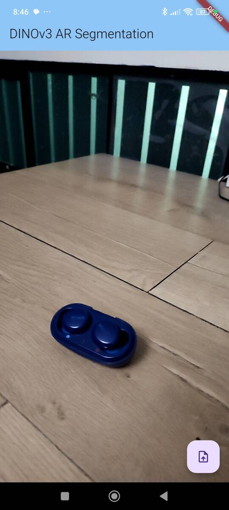
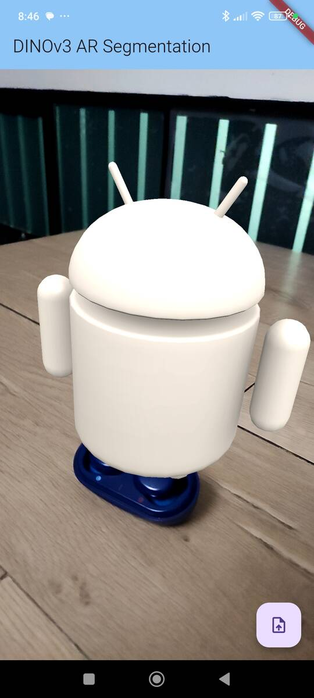

# DINOv3 Real-Time AR Segmentation & Automated Hit-test in Flutter

This repository contains a Flutter application demonstrating real-time object segmentation in an Augmented Reality (AR) environment. The project uses the DINOv3 model as a feature extractor, running on-device via ONNX Runtime, to segment objects in a live camera feed from an Android device. The segmentation mask is then used to place a 3D object in the real world using ARCore.

The core idea is to provide the application with a single reference image (a "prototype") of an object. The app then continuously analyzes the camera feed, identifies the object that is most similar to the prototype, and highlights it with an overlay. It also calculates the object's center (centroid) to allow for AR object placement via automatic [instant placement hit-test](https://developers.google.com/ar/develop/java/instant-placement/developer-guide#kotlin_2).

## 📸 Screenshots
 

## ✨ Features
* **Real-time AR View:** Integrates ARCore into a Flutter app using `PlatformView`.

* **On-Device AI:** Performs all segmentation processing directly on the device. No cloud connection is needed.

* **Custom Object Segmentation:** Users can create a feature "prototype" from any reference image with a transparent background.

* **Similarity-Based Detection:** Uses cosine similarity to compare features from the camera feed with the object prototype.

* **Largest Area Filtering:** Intelligently identifies and isolates the largest contiguous segmented area to reduce noise.

* **AR Object Placement:** Automatically places a 3D object at the centroid of the detected real-world object.

## ⚙️ How It Works
The application has a hybrid architecture, combining a Flutter frontend with a native Android backend for handling AR and AI processing.

1. **Flutter UI (`ar_screen.dart`):**

    * Provides the main user interface, including the camera view container and the "Set Reference" button.

    * Uses a MethodChannel (dino_ar_channel) to communicate with the native Android code.

    * Sends the user-selected reference image (as a byte array) to the native side to create a feature prototype.

2. **Native Android - Kotlin (`DinoARView.kt` & others):**
    * **`PlatformView` Integration:** `DinoARPlugin.kt` and `DinoARViewFactory.kt` register a native view (`DinoARView`) that can be embedded directly within the Flutter UI.

    * **ARCore & OpenGL:** `DinoARView.kt` manages the ARCore `Session` and the `GLSurfaceView`. It uses `BackgroundRenderer` to draw the camera feed and `ObjectRenderer` to draw 3D models.

    * **Camera Frame Processing:** On every few frames, it captures the camera image, converts it from YUV to RGB format using OpenCV, and crops it to match the screen's aspect ratio.

    * **Inference (`SegmentationProcessor.kt`):** The processed image frame is sent to the `SegmentationProcessor`. This class:

        * Loads the `dinov3_feature_extractor.onnx` model using ONNX Runtime.

        * Preprocesses the image into patches and runs inference to extract a feature vector for the entire scene.

        * Compares the scene's features with the stored object prototype using cosine similarity, generating a grid of scores.

        * Performs a Breadth-First Search (BFS) to find the largest connected component of high-scoring patches, filtering out noise.

        * Calculates the centroid of this largest component.

    * **Rendering (`OverlayRenderer.kt`):** The final scores are used by an OpenGL shader to draw a semi-transparent colored mask over the detected object in real-time.

    * **Hit-Testing:** When a placement is requested, it uses the calculated centroid coordinates to perform an ARCore instant placement hit-test.

## 🚀 Getting Started
**Prerequisites**
* Flutter SDK (version 3.x or later)

* Android Studio

* An ARCore-compatible Android device running Android 7.0 (Nougat) or later.

**Installation**
1. **Clone the repository:**
    ```bash
    git clone https://github.com/IoT-gamer/flutter_dinov3_arcore_demo.git
    cd flutter_dinov3_arcore_demo
    ```
2. **Export Your DINOv3 ONNX Model:**

    This project requires a DINOv3 ONNX model. You can export your own by following the steps in this Jupyter Notebook:

    **[DINOv3 ONNX Export Notebook](https://github.com/IoT-gamer/segment-anything-dinov3-onnx/blob/main/notebooks/dinov3_onnx_export.ipynb)**

    Once you have the `dinov3_feature_extractor.onnx` file, place it in the `android/app/src/main/assets/` directory.

3. **Get Flutter dependencies:**
    ```bash
    flutter pub get
    ```
4. **Build and run the application:**

    Connect your ARCore-compatible Android device and run:
    ```bash
    flutter run
    ```

## 📱 Usage
1. **Create a Reference Image:**

    You need a reference image of the object you want to segment. This image must be in RGBA format (e.g., a PNG with a transparent background), where only the object itself is non-transparent.

    You can easily create such an image using the **[Flutter Segment Anything App](https://github.com/IoT-gamer/flutter_segment_anything_app)**
2. **Set the Prototype/Reference:**

    * Launch the DINOv3 AR app.

    * Tap the floating action button with the upload icon.

    * Select your RGBA reference image from the device's gallery.

    * A toast message will confirm that the "prototype" was created successfully. The app will immediately start segmenting.

3. **Segment and Place:**

    * Move around and point your camera at the real-world object that matches your reference image.

    * A green overlay should appear on the object, highlighting the segmented area.

    * The app will automatically attempt to place a 3D model at the center of the object once it finds a suitable surface. A confirmation message will appear when the object is placed.

## ❗ Troubleshooting
* **No Overlay Appears:** Move the camera slowly closer and ensure the object is well-lit and clearly visible.
* **Black Screen:** Ensure your camera cover is open before app starts and that the app has camera permissions.


## 📂 Key Project Files
* `lib/ar_screen.dart`: The main application screen, handling UI and method channel communication.

* `android/.../DinoARView.kt`: The core native class that implements the `PlatformView` and manages the ARCore session, camera, and renderers.

* `android/.../SegmentationProcessor.kt`: Handles loading the ONNX model, preprocessing frames, running inference, and calculating similarity scores to find the target object.

* `android/.../OverlayRenderer.kt`: A simple OpenGL renderer that draws the segmentation mask as a colored overlay on the `GLSurfaceView`.

* `android/.../DinoARPlugin.kt`: The Flutter plugin entry point that registers the `PlatformViewFactory`.

## 📜 License
This project is licensed under the MIT License. See the `LICENSE` file for details.

## 🙏 Acknowledgments
* [DINOv3 Model](https://github.com/facebookresearch/dinov3): For providing a powerful feature extractor for image segmentation.
* [ONNX Runtime](https://onnxruntime.ai/): For enabling efficient on-device inference.
* [ARCore](https://developers.google.com/ar): For the augmented reality capabilities.
